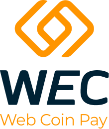

<h1 align="center">
  
   
  Web Coin Pay
   
</h1>

<h4 align="center">
  Documentation for entire list of <a href="https://wec.money">WEC Chain</a> technologies
</h4>

  <a href="#quick-start">Quick Start</a> •
  <a href="#deploy">Deploy</a> •
  <a href="#Deployment">Deployment</a> •
  <a href="#Channel">Channel</a> •
  <a href="#Contribution">Contribution</a> •
  <a href="#Resources">Resources</a>

## What's WEC?

The Web Coin Pay ecosystem combines people from all over the world, enabling them to get passive income through several marketing and investment programs, and purchase goods, real estate, and cars at the best possible price on the trading platform. Web Coin Pay coins used in the ecosystem are our internal currency, which shows a steady growth in value, and experts suppose that WEC is one of the most promising digital financial resources for long-term investment

# Quick Start
This guide walks the user through the WEC Chain architecture.    
[WEC Quick Start](./wec_chain.md#logical-architecture-diagram)

Entire documentation for all WEC technologies [available here](./wec_chain.md)

# Deployment
This guide walks the user through how to deploy a node.
[https://docs.goquorum.com/en/latest/Getting%20Started/running](https://docs.goquorum.com/en/latest/Getting%20Started/running)  

# Contribution
If you'd like to contribute to WEC technologies, please follow below.  
[Contribution](./CONTRIBUTING.md)
